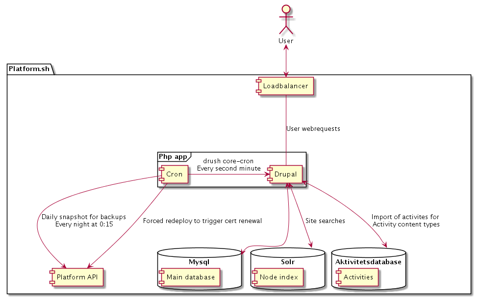

# DDS.dk documentation

## Architecture

## Other
* [Aktivitetsdatabase documentation](aktdb/api/docs.md)

## Solr
dds.dk uses a Solr searching.

The integration is handled by a combination of the [search_api](https://www.drupal.org/project/search_api)
and [search_api_solr](https://www.drupal.org/project/search_api_solr) modules.
The former handles.

search_api_solr requires a custom configuration of Solr to function. This
configuration consists of

1. A base-configuration that is the same across all sites.
2. Site-specific structural-configurations such as additional index-fields for
   each configured language.
3. Content-specific configuration such as a list of words that should not be
   indexed (stop-words) or a a dictionary used to detect and split composite
   words.

The search_api_solr module can store all of the above in a sites configuration,
and can export a full config.zip file with all of the configuration needed to
configure a solr-core.

### content language
dds.dk has a somewhat special setup with regards to search_api_solr languages.

In order to provide the best possible search, a search-index such as Solr will
require language-specific configurations. search_api_solr did not have a
particularity sophisticated handling of languages when dds.dk was originally
implemented. As dds.dk was never meant to be a multi-lingual site, and as it was
never configured with danish as its content language. Instead we used the default
which resulted all content on the site being stored in field-instances with
`langcode=en`. This may or may not have been a conscious decision, but here we
are.

The langcode mismatch did not have any consequences on the original solr setup
as the module at that point had a pretty simple handling of the configuration of
indexed fields as mention. This has since then changed.

Which leads us to the current solr setup. The current version of search_api_solr
now takes great care to track which content-language a specific field-value uses
and processes the field using a language-specific configuration.

This left us with two ways forward. We could migrate all content
to new fields with `langcode=da` and make sure that everything worked as expected.
Or, we could reconfigure the configuration for english content to fit danish.

We went with the last approach. As a result, we've had to modify the stock
 `search_api_solr.solr_field_type.text_en_7_0_0.yml` and `search_api_solr.solr_field_type.text_phonetic_en_7_0_0.yml`
drupal configs and replace them with their `_da_` counterparts.

### Updating search_api_solr and search_api
In general, follow the official documentation, and be very aware of changes to
the underlying solr fields. In general, the following steps should suffice.

1. Reset a local development environment
2. Update the search_api / search_api_solr / etc modules
3. Export the site configuration and commit the result
4. Access https://ddsdk.docker/admin/config/search/search-api/server/solr (host-name may vary), and get a fresh config.zip
5. Place the contents of `config.zip` into `.platform/solr_8.x_config`
6. Do a reset, re-index the site (`drush sapi-i`), and verify that everything works.
